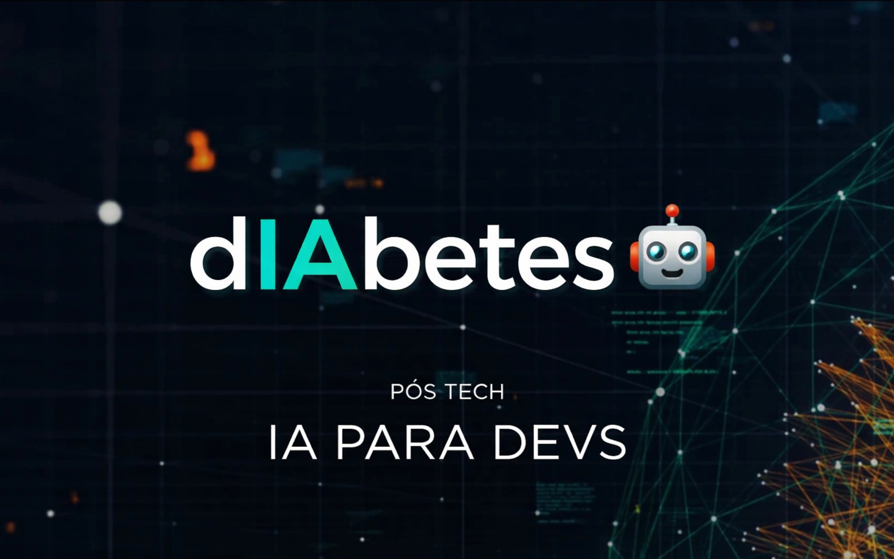

# 🧠 dIAbetes - Diagnóstico de Diabetes com Algoritmos Genéticos e LLM



## 📌 Sobre o Projeto

Este projeto foi desenvolvido como parte do **Tech Challenge – Fase 2** da pós-graduação **IA para Devs (FIAP)**.

O objetivo é otimizar um modelo de **Machine Learning para diagnóstico de diabetes**, utilizando **Algoritmos Genéticos** para busca automática dos melhores hiperparâmetros do modelo e, posteriormente, integrar uma **Large Language Model (LLM)** para geração de explicações em linguagem natural sobre as predições realizadas.

O sistema atua exclusivamente como **ferramenta de apoio à decisão médica**, não substituindo a avaliação de um profissional de saúde.

---

# 🎯 Problema

O diagnóstico precoce da diabetes é fundamental para reduzir complicações clínicas e melhorar a qualidade de vida dos pacientes.

Neste contexto, instituições de saúde necessitam de ferramentas capazes de:

- Auxiliar na triagem de pacientes;
- Reduzir a quantidade de casos não identificados (falsos negativos);
- Apoiar o profissional de saúde durante a tomada de decisão.

---

# 🧪 Solução Proposta

A solução foi dividida em duas etapas.

## Fase 1

Foi desenvolvido um modelo de Machine Learning utilizando o algoritmo **Random Forest**, responsável por realizar a classificação dos pacientes.

O modelo foi utilizado como ponto de partida para esta segunda fase.

Repositorio da fase 1:

https://github.com/thiago-roock/dIAbetes

## Fase 2

Nesta etapa o modelo passou por um processo de otimização utilizando um **Algoritmo Genético**, responsável por encontrar automaticamente uma combinação mais eficiente de hiperparâmetros.

Após a otimização, o modelo é integrado a uma **Large Language Model (LLM)** para geração automática de explicações clínicas em linguagem natural.

---

# ⚙️ Pipeline da Solução

O projeto foi desenvolvido em um único Notebook Jupyter seguindo o fluxo abaixo:

1. Carregamento da base de dados;
2. Pré-processamento dos dados;
3. Modelo base (Random Forest);
4. Implementação do Algoritmo Genético;
5. Otimização dos hiperparâmetros;
6. Comparação entre modelo base e modelo otimizado;
7. Integração com LLM para geração de relatórios clínicos.

---

# 🧬 Algoritmo Genético

O Algoritmo Genético foi implementado do zero, sem utilização de bibliotecas específicas para otimização.

As principais características implementadas foram:

- Geração aleatória da população inicial;
- Função de fitness baseada em métricas médicas;
- Seleção por torneio;
- Cruzamento entre indivíduos;
- Mutação adaptativa progressiva;
- Elitismo;
- Evita cruzamento entre indivíduos idênticos;
- Histórico do melhor, pior e fitness médio por geração;
- Testes unitários das principais funções.

---

# 📊 Função de Fitness

Como o problema está relacionado ao diagnóstico médico, foi adotada uma função de fitness priorizando a capacidade do modelo identificar pacientes diabéticos.

```python
fitness = (
    (0.7 * recall) +
    (0.1 * precision) +
    (0.1 * especificidade)
)
```

Essa estratégia reduz a probabilidade de falsos negativos, considerados mais críticos em aplicações médicas.

---

# 📈 Resultados

Após a otimização utilizando Algoritmos Genéticos, foi possível obter melhorias no comportamento do modelo.

Principais resultados:

- aumento da identificação correta de pacientes diabéticos;
- redução da quantidade de falsos negativos;
- comparação entre modelo base e modelo otimizado através de matrizes de confusão;
- análise da evolução do fitness ao longo das gerações.

Além disso, toda a evolução do algoritmo é registrada durante a execução, apresentando:

- melhor fitness;
- fitness médio;
- pior fitness;
- taxa de mutação adaptativa;
- indivíduo mais apto da geração.

---

# 🤖 Integração com LLM

Após encontrar os melhores hiperparâmetros através do Algoritmo Genético, o modelo otimizado é integrado a uma Large Language Model (LLM) para geração automática de relatórios clínicos.

A LLM recebe as características do paciente juntamente com a predição realizada pelo modelo e produz uma explicação em linguagem natural, tornando os resultados mais compreensíveis para profissionais da saúde.

---

# 🧪 Testes

O projeto possui testes unitários para validar os principais componentes do Algoritmo Genético:

- geração de indivíduos;
- cálculo da função de fitness;
- seleção por torneio;
- cruzamento;
- mutação adaptativa;
- cálculo da taxa de mutação;
- execução do algoritmo genético;
- execução dos experimentos.

---

## 📂 Estrutura do Projeto
```
dIAbetes/
│
├── dataset/         # Base de dados utilizada
├── notebook/        # código fonte completo e documentado
├── resultados/      # Gráficos, métricas e análises
├── relatorio-tecnico/   # Explicações detalhadas reforçando o código
├── video-demonstracao/   # Vídeo do funcionamento
├── requirements.txt     # lista de todas bibliotecas usadas
├── README.md # com instruções sobre o projeto

```
---

# 📄 Dataset

Dataset utilizado:

https://www.kaggle.com/datasets/mathchi/diabetes-data-set/data

---

# ⚙️ Tecnologias Utilizadas

- Python
- Pandas
- NumPy
- Scikit-Learn
- Matplotlib
- Jupyter Notebook
- Ollama

---

# ▶️ Como Executar

## Clonar o repositório

```bash
git clone https://github.com/thiago-roock/dIAbetes-tech-challenge-fase2.git
```

## Instalar dependências

```bash
pip install -r requirements.txt
```

## Executar

```bash
jupyter notebook
```

Abra o notebook principal do projeto.

---

# 📌 Considerações Finais

O trabalho demonstrou que Algoritmos Genéticos podem ser utilizados para otimizar automaticamente hiperparâmetros de modelos de Machine Learning, proporcionando melhorias no desempenho do classificador sem necessidade de ajustes manuais.

A integração com uma Large Language Model complementa a solução ao transformar predições numéricas em explicações textuais, tornando o sistema mais interpretável e útil como ferramenta de apoio ao diagnóstico médico.

---

## 👨‍💻 Autor

**Thiago de Melo Lima**

Pós-graduação **IA para Devs – FIAP**

Turma **9IADT**